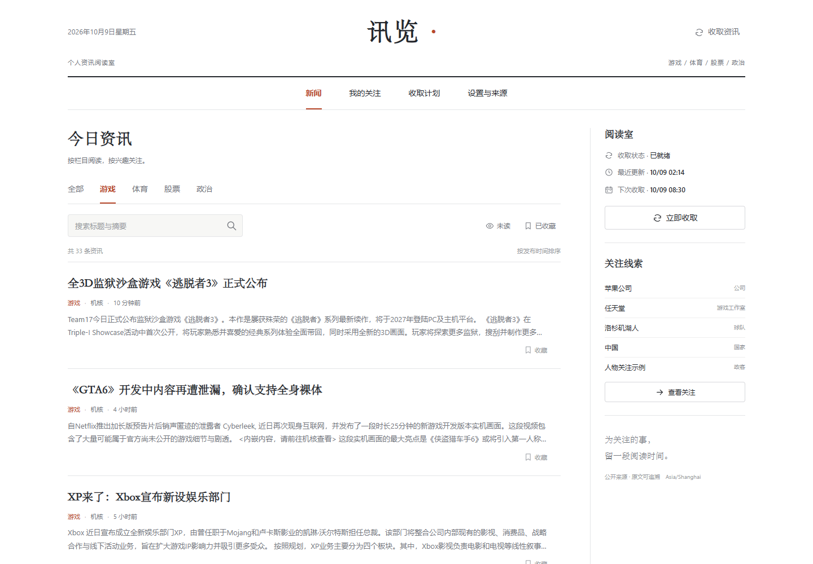
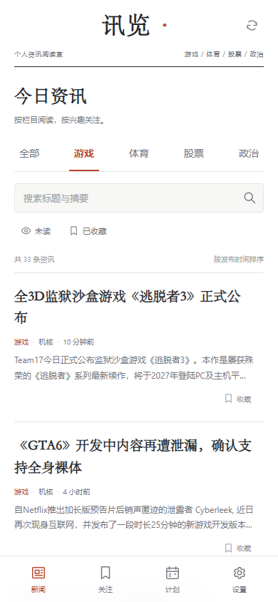
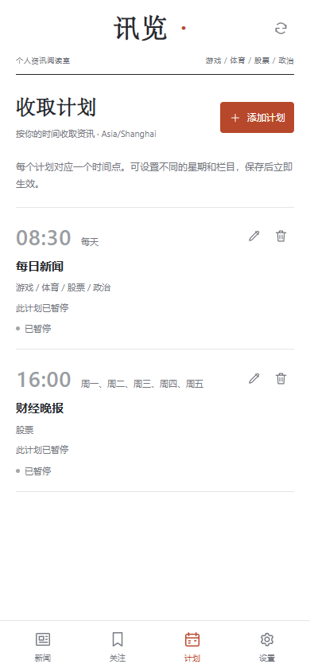
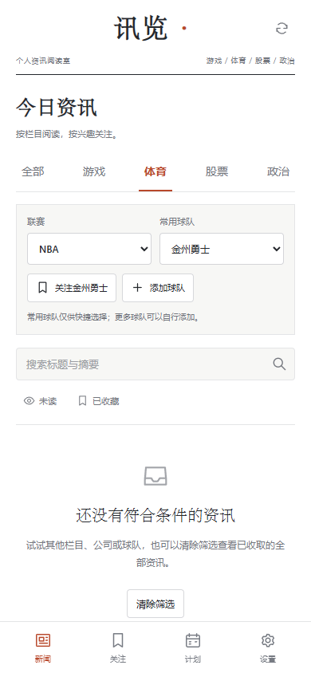
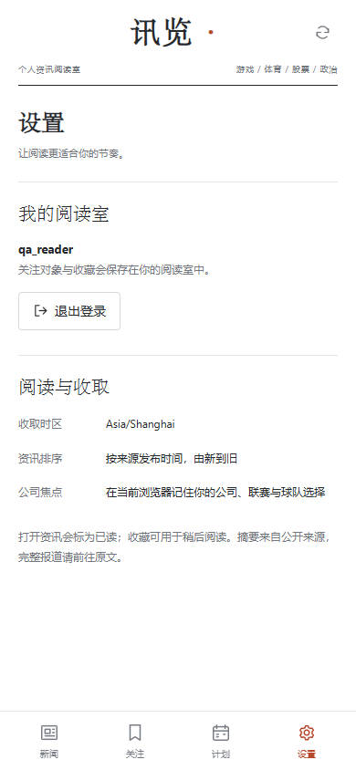

# 讯览（Newsroom）v1.1.4

讯览是一款单用户、自托管的新闻阅读器。它按游戏、体育、股票和国际新闻分类汇总来源，支持关注词条、收藏、已读状态与定时抓取。视觉方向以财新现有识别度为灵感。



 

 

截图使用独立测试数据中的实际资讯，关注对象与时间计划为演示设置。正式安装时自行创建账户、添加关注并设置计划。

讯览只整理来源提供的 RSS 摘要和文章链接，不生成 AI 摘要、不翻译文章，也不抓取付费墙全文。关注命中表示该条原始文章与词条匹配，不代表系统生成了新消息。首次安装不会写入虚构新闻；抓取为空时，阅读页会显示真实空状态。

## 已配置来源

初始配置含 15 个已启用 RSS 来源和 2 个默认关闭的 Steam 新闻示例。来源覆盖会随网站 RSS 内容变化。来源的增删、停用和错误查看在 `/admin` 管理入口中进行。

| 分类 | 已启用来源 |
| --- | --- |
| 游戏 | [游研社](https://www.yystv.cn/rss/feed)、[机核](https://www.gcores.com/rss) |
| 体育 | [中新网体育](https://www.chinanews.com.cn/rss/sports.xml)、[BBC 体育](https://feeds.bbci.co.uk/sport/rss.xml)、[ESPN](https://www.espn.com/espn/rss/news)、[ESPN NBA](https://www.espn.com/espn/rss/nba/news)、[BBC 足球](https://feeds.bbci.co.uk/sport/football/rss.xml)、[The Guardian 英超](https://www.theguardian.com/football/premierleague/rss)、[The Guardian 皇家马德里](https://www.theguardian.com/football/realmadrid/rss) |
| 股票 | [中新网财经](https://www.chinanews.com.cn/rss/finance.xml)、[FT 中文网](https://www.ftchinese.com/rss/feed)、[The Guardian 财经](https://www.theguardian.com/business/rss) |
| 政治 | [中新网国际](https://www.chinanews.com.cn/rss/world.xml)、[BBC 国际](https://feeds.bbci.co.uk/news/world/rss.xml)、[The Guardian 国际](https://www.theguardian.com/world/rss) |

Steam 环世界（App ID `294100`）和只狼（App ID `814380`）是可选示例，初始关闭。启用后读取 Steam 官方新闻接口。抓取到的标题、来源摘要和原文链接均来自来源页面；覆盖与更新频率由来源决定。

## 功能

- 按游戏、体育、股票、政治分类阅读，可搜索文章并筛选未读、收藏和关注命中。
- 阅读者可管理自己的公司、工作室、球队、国家或政治人物关注。名称、别名或股票代码可命中；关键词可作为额外上下文条件，排除词优先。
- 手动抓取来源，并为不同分类设置多个抓取时间。初次安装不会自动创建定时任务；时区默认为 `Asia/Shanghai`，星期一在 API 中记为 `0`。停机漏过的时段会按补跑设置合并，最多补跑一次。
- 「股票」分类整理财经新闻，不提供实时行情或交易功能。
- 文章、阅读状态、关注词条、来源、定时任务和设置保存在本机 SQLite 数据库中。
- 管理入口提供 JSON 配置导出。导出仅含设置、来源、关注词条和定时任务，不含文章数据库或登录凭据。

## 公司与体育关注目录

公司关注可从 7 个常见公司模板起步：腾讯、阿里巴巴、苹果、英伟达、微软、索尼和任天堂。也可以添加自己的公司，编辑显示名称、别名、市场和证券代码。命中只在已收取来源的文章标题与来源摘要中进行，不代表全网监测。

体育关注支持先选联赛、再选球队，可关注联赛或单支球队。内置 29 支常见球队：NBA 12 支、英超 8 支、西甲 9 支，包含金州勇士、皇家马德里和巴塞罗那。它们是起步目录，不是联赛完整名册，也不会随赛季自动更新。目录参考：[NBA 球队](https://www.nba.com/teams)、[英超俱乐部](https://www.premierleague.com/en/clubs)、[LaLiga 俱乐部](https://www.laliga.com/en-EG/laliga-easports/clubs)。

预置联赛关注也会包含已关联球队的文章，即使文章没有提到联赛名称。你可以添加自定义联赛或球队；自定义球队可独立关注，也可选填一个预置联赛。未绑定预置联赛的自定义联赛按自身名称和别名匹配。联赛和球队识别只检查已收取文章的标题与来源摘要，不提供实时比分或赛果。

内置球队关注会自动识别目录中的中文名、英文名及已收录的简称，例如“勇士”可匹配 `Golden State Warriors` 和 `Warriors`，无需自行补填英文别名。更新目录时，已有球队与联赛关注会重新匹配历史文章。自定义球队仍按你填写的名称与别名识别；上下文关键词和排除词继续生效。

## 阅读者与管理入口

阅读者日常使用新闻、关注、收取计划、手动收取和退出登录。阅读者的「设置」只显示只读时区；来源、系统设置、收取错误和配置导出不显示在普通阅读界面。

管理入口使用独立地址：本地预览为 `http://127.0.0.1:8000/admin`，服务器本机预览为 `http://127.0.0.1:8088/admin`，HTTPS 部署为 `https://<你的域名>/admin`。先登录阅读室，再在管理入口用同一个账户名和密码再次验证。管理授权固定有效 30 分钟，不会因活动自动延长，并绑定当前阅读者会话；退出阅读室会同时撤销管理授权。管理数据的读取与修改接口都需要有效管理授权，授权状态、登录和退出接口用于建立或撤销授权。

管理入口负责维护资讯来源、全局时区、补跑设置、收取记录和 JSON 配置导出。定时计划和手动收取仍由阅读者界面操作。

需要让 RSS 或 Steam 请求经由代理时，可在 `.env` 显式设置 `NEWSROOM_OUTBOUND_PROXY`，填入一个容器网络可访问的 HTTP 或 HTTPS 代理地址。应用不会自动读取主机上的 `HTTP_PROXY` 或 `HTTPS_PROXY`。容器里的 `127.0.0.1` 指容器本身，不是服务器主机；若代理运行在主机上，需使用一个允许容器访问的主机地址，并确认代理监听该接口。

`NEWSROOM_FETCH_MODE` 控制连接方式，默认 `auto`：

| 设置 | 连接方式 |
| --- | --- |
| `auto` | 有显式代理时优先代理，临时连接失败后尝试直连；没有代理时只直连重试。 |
| `direct` | 只直连，忽略代理配置。 |
| `proxy` | 只使用显式配置的代理，不回退到直连；未配置代理时拒绝启动。 |

每个来源最多尝试 4 次，总等待预算为 70 秒。临时连接失败、读超时和 429/502/503/504 响应可退避重试；连接优先使用公网 IPv4，并在有多个 IPv4 地址时轮换，只有无 IPv4 时才使用 IPv6。服务端要求的 `Retry-After` 等待超过剩余预算时结束本次收取，不提前重试。403/404、非法地址、无效内容和超大响应不会反复请求。失败最终仍会记录在管理入口；已成功收取的文章会保留。

采集最多并行处理 3 个来源，较快的来源会在完成后立即保存，不必等待同批慢来源。管理页顶部的「来源连接」显示当前连接方式、域名解析方式和失败数量，可一键只重试失败且仍启用的来源。重试仍与定时计划、普通手动收取共用采集锁，不会启动重叠任务。连接信息和失败重试接口需要管理员再次验证；普通阅读页只提示本次收取成功、部分失败或失败。

`NEWSROOM_DNS_MODE` 控制域名解析，默认 `fallback`，已有 `.env` 无需补填即可启用：

| 设置 | 解析方式 |
| --- | --- |
| `fallback` | 优先系统 DNS；解析失败、超时或返回非公网地址时，尝试 DNSPod 加密 DNS。正常解析不调用备用服务。 |
| `system` | 只用系统 DNS，保留原有行为。 |
| `https` | 域名只通过 DNSPod 加密 DNS 查询公网 IPv4 地址；直接填写的公网 IP 不需要查询。 |

备用查询使用固定的 `https://doh.pub/dns-query`，会将待解析的来源域名发送给 DNSPod，不上传账户、关注词条或文章。查询最多等待 6 秒，响应限制 64 KB；不接受跳转、无效记录或非公网地址，实际新闻请求仍固定到验证后的 IP，并保留 Host/SNI 与证书检查。备用查询遵守抓取模式：`proxy` 模式只走显式代理，`direct` 模式只直连，`auto` 有代理时可在临时连接失败后尝试直连。服务介绍参考 [DNSPod 官方接入说明](https://docs.dnspod.cn/notices/mian-fei-ban-dot-dohbu-zai-gong-kai-ipjie-ru-de-gong-gao/)。

加密 DNS 只能处理部分解析故障，不提供代理出口，也不保证新闻网站可达。若服务器无法建立连接、新闻源拒绝该出口或订阅地址失效，需要分别检查网络、来源访问限制或地址。`fallback` 已解析得到公网地址但连接仍失败时，不会盲目更换 DNS；可用 `https` 模式做对比诊断，再决定保留哪种配置。

修改 `.env` 后，按当前部署方式重新运行 `docker compose ... up -d --build`，让环境变量进入容器。仅执行 `restart` 不会更新容器里的环境变量。自动切换不会创建代理，也不能替代服务器可用的网络出口。

## Windows 本地使用

电脑本地使用时，采集、数据库和阅读网站都运行在这台电脑上，不连接腾讯云同步新闻。电脑能连通新闻源，才可以收取对应来源；关闭程序或电脑休眠后，定时采集暂停。首次本地使用需创建本地账号，与腾讯云上的账号和数据相互独立。

需要先安装 Python 3.11。下载项目 ZIP 并解压后，双击 `start-local.cmd`，启动完成会自动打开浏览器。也可以在 PowerShell 中执行下列命令。项目依赖安装在本地 `.venv\Lib\site-packages`；启动脚本忽略 pip 环境变量和用户配置，并显式指定安装目录，避免写入全局 target：

```powershell
.\run-local.ps1
```

浏览器地址为 `http://127.0.0.1:8000`；管理入口为 `http://127.0.0.1:8000/admin`。`run-local.ps1 -NoBrowser` 可关闭自动打开浏览器。保持启动窗口运行，关闭窗口会停止本地采集和网站。

本地启动会优先保留显式的 `NEWSROOM_OUTBOUND_PROXY`，否则读取 Python 可识别的本机 HTTP(S) 代理配置（环境变量或 Windows 系统静态代理）。这一自动检测只在本地启动入口生效，腾讯云部署不会自动读取主机代理。浏览器插件、PAC 自动代理规则和仅有 SOCKS 的配置不能据此保证识别；可给本地程序设置实际可用的 HTTP(S) 代理地址，或使用能供程序直连的本机网络。无需把代理设置交给腾讯云。

若希望手动启动，可在 PowerShell 中运行：

```powershell
py -3.11 -m venv .venv
.\.venv\Scripts\python.exe -m pip --isolated install --upgrade --target .\.venv\Lib\site-packages --disable-pip-version-check -r requirements.txt
$env:NEWSROOM_DATA_DIR = "$PWD\data"
$env:TZ = "Asia/Shanghai"
$env:COOKIE_SECURE = "0"
.\.venv\Scripts\python.exe -m app.local
```

应用内的定时调度器使用单进程运行；本地和 Docker 命令都固定为一个 Uvicorn worker。不要把 `--workers` 调大，否则多个 worker 会各自启动调度器。

调度器每 15 秒检查一次到期计划；若已有采集正在运行，会在这轮采集结束后处理到期计划。

## OpenCloudOS 9 部署

在服务器上获取源码并进入项目目录：

```bash
sudo yum install -y git
git clone https://github.com/CandyTea/xunlan-newsroom.git
cd xunlan-newsroom
```

然后按下文安装 Docker、填写 `.env` 并启动应用。

### 1. 准备 Docker 与 Compose v2

如果 Docker 已安装且服务正常运行，跳过安装步骤。腾讯云《搭建 Docker》文档的 **OpenCloudOS 9.0** 章节给出的安装与启动命令是：

```bash
sudo yum install docker -y
sudo systemctl start docker
sudo systemctl enable docker
sudo docker info
```

该文档也列出 `docker info` 作为安装检查。讯览需要 Docker Compose v2，并使用 `docker compose` 命令。先确认：

```bash
docker compose version
```

如果命令不可用，请按 [Docker 官方 Linux Compose 插件安装说明](https://docs.docker.com/compose/install/linux/) 安装 Compose 插件，再运行版本检查。该指南列出 RPM 系统的仓库安装方式和手动插件安装方式；请按服务器当前 Docker 软件源选择可用方式。

### 2. 设置首次初始化令牌并启动

在服务器上进入本项目目录，创建环境文件：

```bash
cp .env.example .env
python3 -c 'import secrets; print(secrets.token_urlsafe(32))'
```

把第二条命令输出的随机字符串填入 `.env` 的 `SETUP_TOKEN=`。令牌只用于保护首次创建账户；创建账户后，登录仍使用你设置的用户名和密码。`COOKIE_SECURE=0` 对应下文的本机 SSH 隧道访问。

然后构建并启动：

```bash
sudo docker compose up -d --build
sudo docker compose ps
sudo docker compose logs -f app
```

默认只监听服务器本机的 `127.0.0.1:8088`。在自己的电脑上建立 SSH 隧道：

```bash
ssh -L 8088:127.0.0.1:8088 <SSH用户>@<服务器公网IP>
```

然后浏览器访问 `http://127.0.0.1:8088`。首次打开时输入 `.env` 中的 `SETUP_TOKEN`，创建单用户账户。

健康检查地址为服务器本机 `http://127.0.0.1:8088/healthz`。容器以非 root 用户运行，SQLite 数据目录 `/data` 使用持久化 Docker 卷；镜像会在首次创建卷时准备可写权限。

### 3. 个人 IP 临时直连

如果要从浏览器直接访问公网 IP，可在项目目录运行以下命令，用公开绑定配置替代本机绑定：

```bash
sudo docker compose --env-file .env --env-file deploy/public-bind.env up -d --build
```

如果所用 Compose v2 版本不支持多个 `--env-file` 参数，也可以直接把 `.env` 中的 `NEWSROOM_BIND` 改为 `0.0.0.0`，然后运行普通启动命令。

随后在腾讯云控制台的实例安全组入站规则中，只允许你当前公网 IP 的 `/32` 来源访问 TCP `8088`。若 OpenCloudOS 主机启用了 `firewalld`，也要在系统防火墙放行该端口。访问地址为 `http://<服务器公网IP>:8088`。

直连 HTTP 只适合受限 IP 下的短期个人预览：登录信息不会经过 TLS 加密。面向长期或多人网络访问时，请配置下面的 HTTPS 入口。没有设置首次初始化令牌时，不要开放公网访问。

### 4. 配置 HTTPS（推荐）

准备一个指向服务器公网 IP 的域名 A 记录；确认公网 TCP `80`、`443` 可到达服务器。编辑 `.env`，把 `NEWSROOM_DOMAIN` 改成真实域名，并设置 `COOKIE_SECURE=1`。然后执行：

```bash
sudo docker compose -f compose.yaml -f deploy/compose.caddy.yaml up -d --build
sudo docker compose -f compose.yaml -f deploy/compose.caddy.yaml ps
```

Caddy 会代理到应用容器并自动申请、续期 TLS 证书；应用端口仍只绑定本机。腾讯云安全组为 TCP `80`、`443` 允许公网访问；若主机启用了 `firewalld`，也放行这两个端口。SSH 端口则继续限制为自己的 IP。打开 `https://<你的域名>` 完成首次初始化。首次配置证书期间可查看：

```bash
sudo docker compose -f compose.yaml -f deploy/compose.caddy.yaml logs -f caddy
```

## 使用说明

- 在 `/admin` 中添加或维护 RSS 来源，或填写 Steam App ID。仅支持 RSS 和 Steam 官方新闻接口；不会把任意网页或付费墙页面当作全文来源。
- 在「关注」中填写名称和别名；名称、别名和股票代码按 OR 关系匹配。填写关键词后，匹配结果还需包含关键词；排除词会优先过滤。
- 在「定时」中设置 `HH:mm` 时间、星期和分类。可建立多个时间点，时区由管理员在 `/admin` 中统一设置，阅读者设置页只读显示该时区。
- 在 `/admin` 中查看收取记录、来源错误并导出配置；普通阅读者无权访问这些数据。
- 阅读卡片中的「来源摘要」是 RSS 或 Steam 提供的文字摘要，经清理后显示；没有来源摘要时不会补写内容。
- 空列表表示当前筛选条件或来源尚无可显示文章。先检查来源状态，再运行手动抓取。
- Steam 官方新闻接口要求容器 DNS 将目标解析到公网地址；如果 DNS 返回私有地址，安全校验会拒绝请求。

## 升级、停止与备份

升级前先按下方步骤备份当前 SQLite 数据目录。新版本启动时会自动迁移现有数据库，保留账户、文章、已读/收藏状态、关注对象和收取计划；无需删除数据库或重新创建账户。旧安装会一次性补入 v1.1.1 新增的四个体育专项来源，已有同地址来源的名称与启用状态保持不变。补入后自行删除的来源不会因重启而恢复。更新完成后点击“收取资讯”，或等待包含体育分类的下一次计划。

GitHub 安装的更新命令：

```bash
cd /path/to/xunlan-newsroom
git pull --ff-only
sudo docker compose up -d --build
```

如果当前使用 Caddy HTTPS，更新时继续同时加载两个 Compose 文件，以保留 Caddy 服务：

```bash
cd /path/to/xunlan-newsroom
git pull --ff-only
sudo docker compose -f compose.yaml -f deploy/compose.caddy.yaml up -d --build
```

如果当前用公开绑定环境文件访问，更新时也保留该环境覆盖：

```bash
cd /path/to/xunlan-newsroom
git pull --ff-only
sudo docker compose --env-file .env --env-file deploy/public-bind.env up -d --build
```

停止默认部署但保留数据库：

```bash
sudo docker compose down
```

Caddy 部署停止时也带上两个 Compose 文件。不要附加 `-v`，否则 Compose 会删除持久化数据卷。

SQLite 文件位于 `/data/newsroom.sqlite3`。备份前先停止应用，再复制整个数据目录（包括可能存在的 SQLite WAL 文件），完成后重新启动：

```bash
mkdir -p backups
container_id=$(sudo docker compose ps -q app)
sudo docker compose stop app
sudo docker cp "$container_id:/data/." "backups/newsroom-data-$(date +%Y%m%d-%H%M%S)"
sudo docker compose start app
```

管理入口中的「导出配置」可下载设置、来源、关注词条和定时任务配置（对应 `GET /api/export`），适合单独留存配置；完整文章和阅读状态仍需备份 SQLite 数据目录。`.env` 含首次设置令牌等部署信息，应妥善保存，避免提交到公开仓库。

## 常见维护命令

```bash
sudo docker compose ps
sudo docker compose logs -f app
sudo docker compose restart app
```

### 球队没有资讯时

先确认收取计划包含“体育”，或手动点击“收取资讯”。球队筛选与关注只整理已收取到的文章，综合体育来源没有相应球队报道时，列表会为空。

若更新并再次收取后仍为空，进入独立的 `/admin` 页面，用现有账号密码再次验证，查看体育来源的最近成功时间和错误信息。“来源请求超时”或“无法连接来源”表示服务器未能取得这些报道；添加英文别名无法解决连接问题。本地能连通某个来源，也不代表腾讯云服务器能连通。v1.1.2 会有限重试及切换可用路线；若服务器需要代理出口，按上文配置 `NEWSROOM_OUTBOUND_PROXY`，然后重新创建容器以应用环境变量。DNS 公网地址校验拒绝表示本机解析结果含非公网地址，需检查服务器 DNS 或域名映射；关闭校验不是解决方式。

在服务器项目目录运行下面的只读命令，可检测现有体育来源，并查看抓取模式与是否已配置代理。检测不会修改数据库、启用来源或写入采集记录，也不会输出代理地址及密码：

```bash
sudo docker compose exec -T app python -u -m app.diagnostics --category sports
```

省略 `--category sports` 时检查所有已启用来源；加 `--include-disabled` 可同时检查关闭的来源。命令在每个来源完成时输出结果。全部通过时退出码为 `0`，有来源失败为 `1`，没有匹配来源或配置无效为 `2`。当前使用额外 Compose 文件或环境文件时，继续使用原来的参数。

Docker 官方 Compose 插件文档：[Linux 安装指南](https://docs.docker.com/compose/install/linux/)。腾讯云 OpenCloudOS 9.0 Docker 步骤：[搭建 Docker](https://cloud.tencent.com/document/product/213/46000)。
